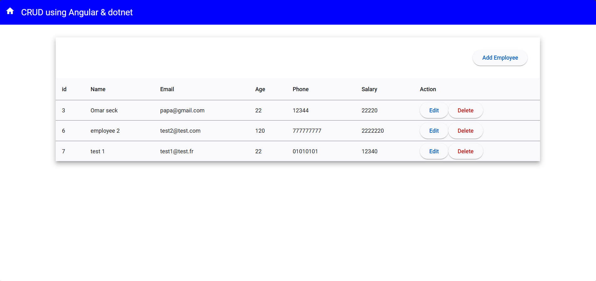
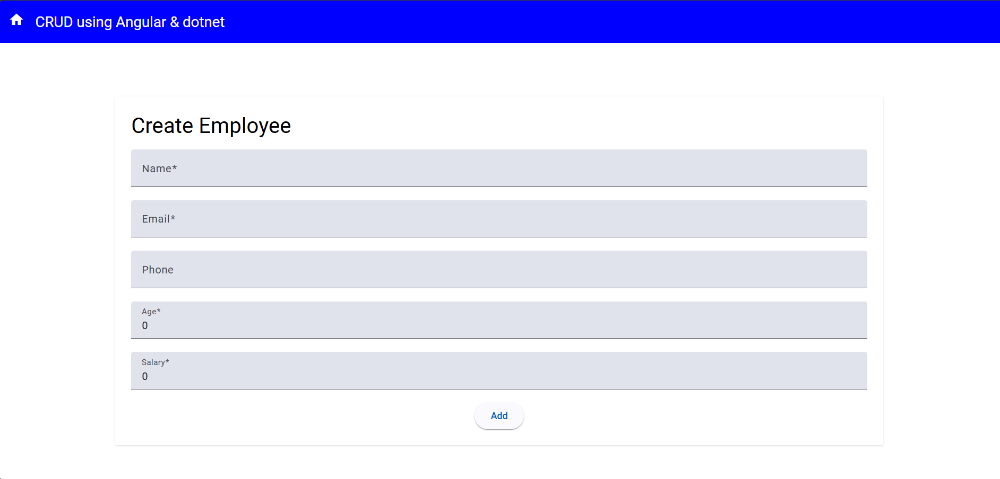

# README for CRUD-app Frontend (Angular)




## Description

The frontend of the CRUD-app is built using Angular and provides the user interface for interacting with the application. This project is designed to be run independently of the backend but communicates with the backend API to perform CRUD operations.

---

## Prerequisites

Before running this project, ensure you have the following installed:

- [Node.js](https://nodejs.org/) (v14 or later)
- [Angular CLI](https://angular.io/cli)
- A text editor like VS Code

---

## Setup

1. **Clone the repository**:

   ```bash
   git clone https://github.com/your-username/frontend-repo-name.git
   cd frontend-repo-name
   ```

2. **Install dependencies**:

   ```bash
   npm install
   ```

3. **Configure API URL**: Open `src/environments/environment.ts` and set the `apiUrl` to the URL where the backend API is hosted.

4. **Run the development server**:

   ```bash
   ng serve
   ```

   Navigate to `http://localhost:4200/` in your browser to view the app.

---

## Build

To build the project for production:

```bash
ng build --prod
```

The build artifacts will be stored in the `dist/` directory.

---

## Contribution

Contributions are welcome! Please create an issue or a pull request to suggest changes.

---

## License

This project is licensed under the MIT License.

---

# README for CRUD-app Backend (.NET Core)

## Description

The backend of the CRUD-app is a RESTful API built using .NET Core. It provides the functionality for managing data and serves as the data source for the frontend.

---

## Prerequisites

Before running this project, ensure you have the following installed:

- [Visual Studio 2022](https://visualstudio.microsoft.com/) (or later) with .NET Core workload
- [SQL Server](https://www.microsoft.com/en-us/sql-server)

---

## Setup

1. **Clone the repository**:

   ```bash
   git clone https://github.com/your-username/backend-repo-name.git
   cd backend-repo-name
   ```

2. **Open in Visual Studio**:

   - Open the `.sln` file in Visual Studio.

3. **Configure the database connection**:

   - Open `appsettings.json` and set the connection string to match your SQL Server configuration.

4. **Apply migrations**: Open the **Package Manager Console** in Visual Studio and run:

   ```powershell
   Update-Database
   ```

5. **Run the API**: Press `F5` or run the project in Visual Studio. The API will be hosted at `https://localhost:5001` (or the port specified in your launch settings).

---

## API Documentation

The API exposes the following endpoints:

- **GET /api/items**: Retrieve all items
- **GET /api/items/{id}**: Retrieve an item by ID
- **POST /api/items**: Create a new item
- **PUT /api/items/{id}**: Update an existing item
- **DELETE /api/items/{id}**: Delete an item

---

## Contribution

Contributions are welcome! Please create an issue or a pull request to suggest changes.

---

## License

This project is licensed under the MIT License.

